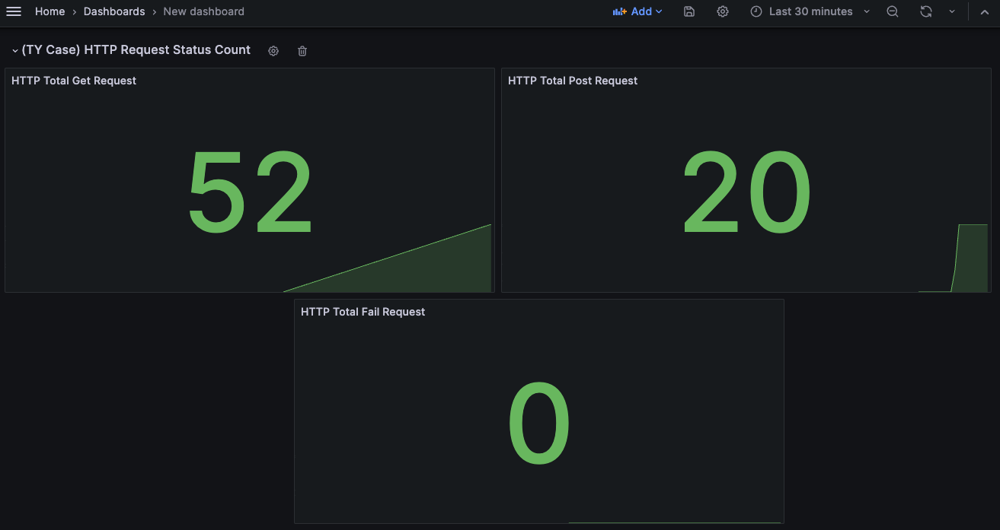

# Shopping Checkout Application

## Technologies Used

- Go
- Docker
- Grafana
- Prometheus
- Swagger
- MongoDB

## Functional Requirements

1. **Cart Management**: Handle up to 10 unique items (excluding VasItems) and a total of 30 products. The total cart amount should not exceed 500,000 TL.
2. **Item Varieties**: Support for different item types like VasItem, DefaultItem, DigitalItem, with specific constraints on quantity and identification.
3. **Digital Items**: Restriction on the quantity and specific categorization (CategoryID 7889).
4. **Default Items**: Common e-commerce products with pricing rules in relation to VasItems.
5. **VasItems**: Represent value-added services, constrained by category and seller ID.
6. **Promotions**: Implementation of various discount strategies like SameSellerPromotion, CategoryPromotion, and TotalPricePromotion.

## Non-Functional Requirements

1. **Reliability**: Robust error handling and consistent performance.
2. **Usability**: Simple and intuitive http-request-based interaction.
3. **Maintainability**: Code should adhere to SOLID principles, Domain Driven Design and be easy to modify or extend.
4. **Performance**: Optimized for fast processing of cart operations.

## Prerequisites

- Go environment setup for development.
- Docker installed for containerization (optional).
- Grafana and Prometheus for monitoring and analytics (optional).

## UML Class Diagram


## Usage

### Running the Application

- **Direct Execution**:

  - After building, you can run the application using:
    ```
    make run
    ```
  - This will start the application using the compiled binary.

- **Development Mode**:

  - For development purposes, you can run the application directly with Go using:
    ```
    make dev
    ```
  - This allows you to run the application without compiling it first.

- **Docker**:
  - To run the application in a Docker container, use:
    ```
    make up
    ```
  - This will build and run the application in a Docker container as defined in your `docker-compose` file.
  - To stop and remove the container, use:
    ```
    make down
    ```

### Swagger Documentation

- To generate Swagger documentation, run:
  ```
  make swag
  ```
- This will create Swagger documentation based on your code annotations.

## Testing

### Running Tests

- **Persistence Tests**:

  - To run persistence layer tests, execute:
    ```
    make persistance-tests
    ```
  - This will run tests located in the `./internal/infrastructure/persistence` directory.

- **Application Tests**:
  - For application layer tests, execute:
    ```
    make application-tests
    ```
  - This will run tests in the `./internal/application` directory.

## Swagger Page


## Grafana Page


